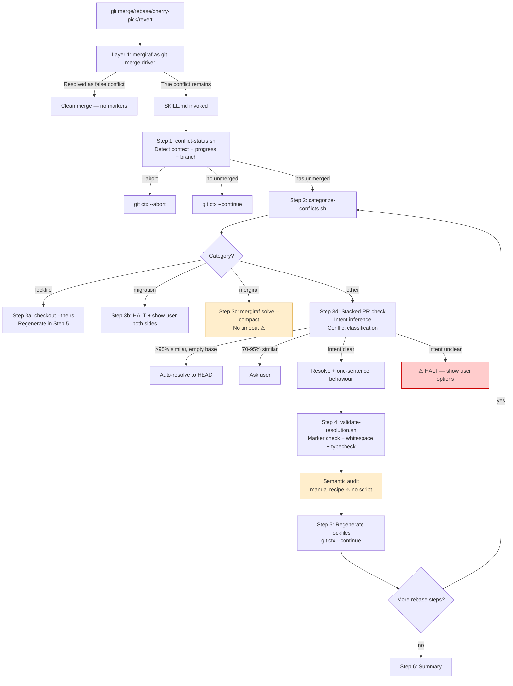
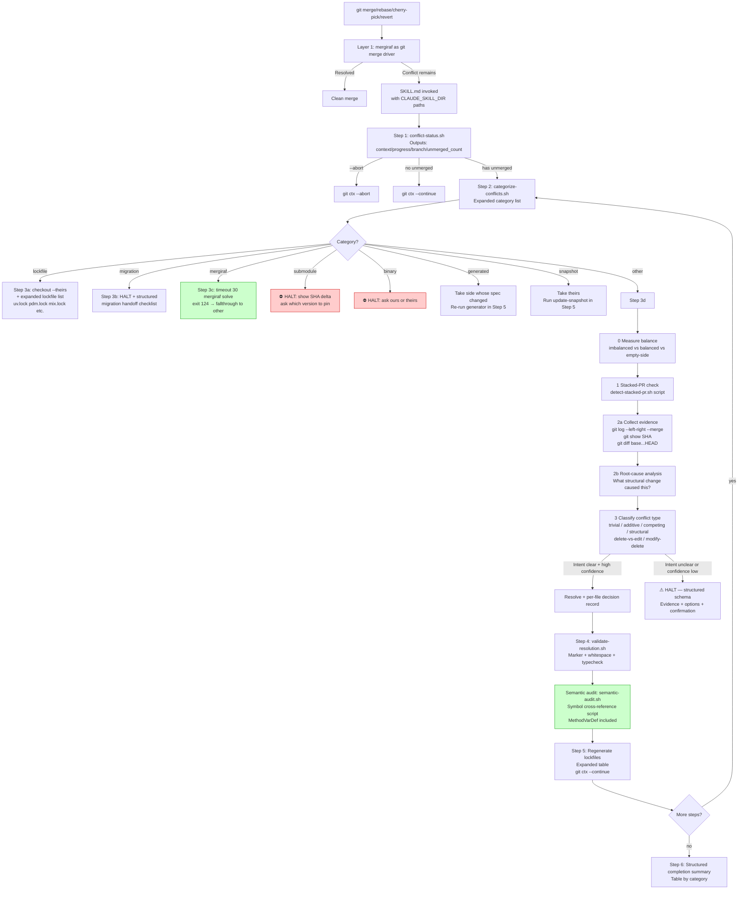

# Improving the git-conflict-resolver Claude Skill: Research Synthesis and Roadmap

**Document version:** 2025-07 · For skill version 0.1.0  
**Audience:** Anyone contributing to or evaluating improvements of the `git-conflict-resolver` Claude skill. Assumes familiarity with Git but not this repository.  
**Source:** Synthesized from 8 focused research dispatches covering the full local corpus at `/home/svnbjrn/dev/conflict-resolver/` and literature through mid-2026.

---

## Table of Contents

1. [Executive Summary](#1-executive-summary)
2. [Current Skill Overview](#2-current-skill-overview)
3. [Evidence Base / Source Inventory](#3-evidence-base--source-inventory)
4. [Major Findings](#4-major-findings)
5. [Prioritized Improvement Table](#5-prioritized-improvement-table)
6. [Concrete Evidence-Backed Heuristics](#6-concrete-evidence-backed-heuristics)
7. [Proposed Skill / Prompt Changes](#7-proposed-skill--prompt-changes)
8. [Proposed Script Changes](#8-proposed-script-changes)
9. [Proposed Tests and Fixtures](#9-proposed-tests-and-fixtures)
10. [Architecture Diagram](#10-architecture-diagram)
11. [Risk Register](#11-risk-register)
12. [Confidence Assessment](#12-confidence-assessment)
13. [Footnotes and Citations](#13-footnotes-and-citations)

---

## 1. Executive Summary

The `git-conflict-resolver` skill (v0.1.0) is an unusually mature Claude skill: it layers a written constitution over a 6-step agentic workflow, delegates deterministic decisions to three fully-tested bash scripts, and grounds its "halt when uncertain" posture in empirical benchmarks. It extends the upstream `@haacked/resolve-conflicts` baseline with three additions that baseline lacks: constitutional rules, intent inference for the "other" category, and a post-resolution semantic-conflict audit.

Eight focused research dispatches found **no correctness regressions** but identified **12 concrete bugs or coverage gaps**, **8 prompt-design improvements**, and a body of recent literature (2025–2026) that directly informs sharper heuristics. The highest-leverage improvements are: (1) fixing the `uv.lock` routing bug, (2) extending migration path coverage to six additional frameworks, (3) adding `submodule`, `binary`, `generated`, and `snapshot` categories before the catch-all `other` routing, (4) wrapping `mergiraf solve` with a `timeout`, (5) scripting the currently prose-only stacked-PR similarity check, and (6) upgrading the SKILL.md frontmatter to use the full set of available Claude Code skill fields (especially `${CLAUDE_SKILL_DIR}` for all file references, `argument-hint`, and `disable-model-invocation`).

The research confirms the skill's central empirical claim: even the best frontier models (Gemini 2.5 Pro: 52.6% code-normalised accuracy on Merge-Bench[¹]) resolve well under 60% of real conflicts correctly without additional context, validating the "halt on ambiguity" posture. Emerging tools — Rover's MtCPG context graph[²], LLMinus RAG pipeline[³], and the LLM-vs-SBSE routing heuristic[⁴] — offer concrete algorithmic improvements that can be partially adopted without requiring code-graph infrastructure.

---

## 2. Current Skill Overview

### 2.1 File Layout

```
/home/svnbjrn/dev/conflict-resolver/
├── git-conflict-resolver/          ← canonical install unit
│   ├── SKILL.md                    ← 325-line LLM procedure (version: 0.1.0)
│   ├── constitution.md             ← 3 inviolable rules + override protocol
│   ├── references/
│   │   ├── intent-inference.md     ← Step 3d method; conflict taxonomy; halt format
│   │   ├── mergiraf-integration.md ← Layer 1 setup, CLI flags, language list
│   │   ├── recurring-conflicts.md  ← rerere guide + git-imerge decision table
│   │   └── semantic-conflicts.md  ← Rover-inspired symbol cross-reference recipe
│   └── scripts/
│       ├── conflict-status.sh      ← vendored from @haacked; detects operation+progress
│       ├── categorize-conflicts.sh ← vendored from @haacked; routes files to 4 categories
│       ├── validate-resolution.sh  ← new (not in @haacked); marker/whitespace/test checks
│       ├── test-conflict-status.sh
│       ├── test-categorize-conflicts.sh
│       └── test-validate-resolution.sh
├── SKILL.md                        ← ⚠ duplicate of git-conflict-resolver/SKILL.md
├── mergiraf-integration.md         ← ⚠ duplicate of references/ version
├── recurring-conflicts.md          ← ⚠ duplicate of references/ version
├── semantic-conflicts.md           ← ⚠ duplicate of references/ version
└── research/                       ← source material (PDFs, benchmarks, drafts)
    ├── research-1.md               ← 42 KB technical survey
    ├── research-2.md               ← LLMinus RFC (Linux kernel)
    ├── Merge-Bench/                ← local clone of benchmark repo
    ├── git-imerge/                 ← local clone
    ├── llm-model-conflict-analysis/← local clone (JKU Vienna)
    └── *.pdf                       ← AgenticFlict, Rover, LLM-vs-SBSE, others
```

**Duplication risk:** The four root-level copies of `SKILL.md`, `mergiraf-integration.md`, `recurring-conflicts.md`, and `semantic-conflicts.md` will drift from the canonical `git-conflict-resolver/` copies on every edit. See §8.9.[¹⁶]

### 2.2 Three-Layer Architecture

| Layer | Mechanism | Handles |
|-------|-----------|---------|
| **1** | `mergiraf` as git merge driver (pre-skill) | False textual conflicts: parallel imports, field additions in commutative-parent nodes |
| **2** | `categorize-conflicts.sh` + per-category strategy | Lockfiles → regenerate; migrations → halt+ask; mergiraf second-pass; stacked-PR duplicates |
| **3** | Intent inference + semantic audit | Genuinely ambiguous `other` files; post-resolution symbol cross-reference |

### 2.3 Six-Step Workflow

| Step | Action | Key artifact |
|------|--------|--------------|
| 1 – Detect | `conflict-status.sh`; apply abort criteria | `SKILL.md:74–97` |
| 2 – Categorize | `categorize-conflicts.sh`; report to user | `SKILL.md:103–117` |
| 3 – Resolve | (a) lockfiles (b) migrations (c) mergiraf (d) other w/ intent inference | `SKILL.md:119–188` |
| 4 – Validate | `validate-resolution.sh` + semantic-conflict audit | `SKILL.md:190–220` |
| 5 – Regenerate & Continue | Rebuild lockfiles; `git <ctx> --continue`; loop for rebase | `SKILL.md:222–251` |
| 6 – Summarize | Auto vs user-directed; rerere replays; semantic checks | `SKILL.md:253–261` |

---

## 3. Evidence Base / Source Inventory

| Source | Type | Key contribution |
|--------|------|-----------------|
| `research/Merge-Bench/` (local clone of `benedikt-schesch/Merge-Bench`) | Benchmark | 7,938 real conflict hunks, 1,439 repos, 11 languages; exact/code-normalised/abstain/wrong reward tiers; current leaderboard |
| `research/research-1.md` | 42 KB survey | Comprehensive coverage of rerere, git-imerge, mergiraf internals, AST tools, LLM benchmarks, Rover, LLMinus, Harmony AI, agentic patterns |
| `research/research-2.md` | RFC text | LLMinus RFC (Sasha Levin, Linux kernel list, Dec 2025); full technical design; real RISC-V example |
| `research/2605.17279v1.pdf` + HTML | Paper | Rover: MtCPG 7-node context graph, MS-BFS clustering, 6-section prompt, k=4 optimal, +17.72% over MergeGen |
| `research/2605.16646v1.pdf` + HTML | Paper | LLM-vs-SBSE: 87% line-combination insight, RRHC algorithm, balanced/imbalanced routing, qualitative failure taxonomy |
| `research/2604.03551v1.pdf` + HTML | Paper | AgenticFlict: 107K+ AI-agent PRs, 27.67% overall conflict rate, per-agent rates, 25-line churn inflection |
| `research/llm-model-conflict-analysis/` | Dataset/schema | JKU Vienna structured conflict taxonomy; `response_schema.json` with `conflict_group` / `resolution_options` / `action`+`rationale` |
| `research/git-imerge/` | Tool | git-imerge README: explicit rerere-off note, pairwise merge semantics |
| `benedikt-schesch/Merge-Bench-Builder` | Dataset pipeline | QUERY_PROMPT canonical text; `build_query()`; `normalize_code()` per language; 4-tier reward implementation |
| `https://docs.anthropic.com/en/docs/claude-code/skills` | Platform docs | Frontmatter fields, `${CLAUDE_SKILL_DIR}`, `disable-model-invocation`, `allowed-tools`, `effort`, token-budget notes |
| `https://arxiv.org/html/2604.03551v1` | Paper (HTML) | AgenticFlict per-agent table, PR-size/conflict-rate Figure 5, Algorithm 1 |
| `https://arxiv.org/html/2605.17279v1` | Paper (HTML) | Rover complete 7-node table, MS-BFS Algorithm 1+2, numerical results Table 3, k=4 ablation |
| `https://arxiv.org/html/2605.16646v1` | Paper (HTML) | SBCR RRHC complete algorithm, RQ1–RQ4 results, hybrid routing pseudocode |

---

## 4. Major Findings

### 4.1 LLM Accuracy Floor — The Skill's Core Premise Is Confirmed

Merge-Bench (Schesch et al., 2026, arXiv:2605.25890)[¹] shows the best frontier model resolves only **52.6%** of real-world conflicts correctly on a code-normalised basis (Gemini 2.5 Pro). Claude Opus 4 reaches 44.8% code-normalised with a **20.4% abstention rate** (leaving conflict markers). The skill's stated "under 60%" claim is accurate and conservative.

**Full leaderboard (all languages, as of research date):**

| Model | Exact | Code-Normalised | Abstain (markers) |
|-------|------:|----------------:|------------------:|
| Gemini 2.5 Pro | 47.1% | **52.6%** | 5.3% |
| Claude Opus 4 | 40.3% | 44.8% | 20.4% |
| o3 Pro | 39.2% | 45.1% | 14.1% |
| R1-0528 671B | 32.0% | 36.5% | 36.9% |
| LLMergeJ 14B (Java only) | **48.8%** | **58.9%** | — |

**Language difficulty:** C is hardest (Gemini 2.5 Pro abstains 31.1%); Java and Python are easiest (best scores).[¹][⁵] The gap between exact and code-normalised is largest in C# (+12.4 pp) and C++ (+7.9 pp), meaning whitespace/comment normalisation matters most there.

**Implication for the skill:** The 20.4% Claude abstention rate (preserved markers) is a known failure mode not yet surfaced in the skill's failure-modes table. It should be handled explicitly: if Claude preserves markers after a resolution attempt, that is a `reward=0.1` signal — treat it as a HALT, not a silent failure.

### 4.2 `uv.lock` Bug — Confirmed

`git-conflict-resolver/scripts/categorize-conflicts.sh:49–57`[⁶] lists nine lockfiles. `uv.lock` (Astral uv Python package manager) is absent. `SKILL.md:234`[⁷] however includes `uv.lock` in the regeneration command table. A `uv.lock` conflict silently routes to `mergiraf` or `other` instead of `lockfile`, causing the model to attempt AI analysis on a file that should simply be regenerated with `uv lock`.

### 4.3 Migration Path Coverage Gap — Confirmed

`is_migration()` at `categorize-conflicts.sh:59–69`[⁶] covers only three frameworks: Django/Flask (`migrations/`), Alembic (`alembic/versions/`), Rails (`db/migrate/`). Six major frameworks are absent: Prisma (`prisma/migrations/`), Ecto/Phoenix (`priv/repo/migrations/`), Liquibase (`db/changelog/`), Flyway (`flyway/sql/` or `V*__*.sql` filename pattern), TypeORM, Drizzle ORM. A Prisma migration would route to `other` and the LLM would attempt to auto-resolve a file where order corruption causes database state machine breakage.[⁷]

### 4.4 Missing File-Type Categories — Five Gap Areas

The current four categories (`lockfile`, `migration`, `mergiraf`, `other`) are insufficient. Five additional categories have clear, mechanical resolution strategies that should never reach the AI-analysis path:

| Missing category | Detection | Correct strategy |
|-----------------|-----------|-----------------|
| **binary** | `git ls-files -s` mode, or `git diff /dev/null` shows "Binary" | HALT immediately; ask user to pick a side |
| **submodule** | `git ls-files --stage` shows mode `160000` | HALT; show SHA delta; ask which version to pin |
| **generated** | Path `*/generated/*`, `*.pb.go`, `*_pb2.py`, `# DO NOT EDIT` header | Take the side whose *source* (proto/spec) changed; re-run generator after rebase |
| **snapshot** | `*/__snapshots__/*.snap`, `*.snap`, `*/testdata/*.golden` | Take theirs; run `jest --updateSnapshot` / `cargo insta accept` after rebase |
| **notebook-outputs** | `*.ipynb` with conflicts only in `outputs` or `execution_count` | Strip outputs; if source cells conflict, HALT |

Currently submodule paths route to `other` (no extension → no mergiraf match), binary files route to `other` (producing garbage when read as text), and generated files receive full AI analysis that produces split-brain between spec and output.

### 4.5 Stacked-PR Similarity Is Unscripted

`SKILL.md:163–167`[⁷] describes the 95%/70%/<70% stacked-PR similarity thresholds in prose. The LLM is expected to eyeball "whitespace-normalised similarity" between conflict sections. This is inconsistent across invocations and untestable. The upstream @haacked skill provides the decision table; the current skill replaces it with prose without a backing script.[⁸]

### 4.6 No Timeout Wrapper for mergiraf

`SKILL.md:289`[⁷] and `references/mergiraf-integration.md:113–114`[⁹] note that a mergiraf hang > 30 seconds should cause fallthrough to `other` category. There is no `timeout` call in any script or SKILL.md step; the LLM must detect the hang subjectively.

### 4.7 Semantic-Conflict Recipe Is Manual, Not Scripted

The Symbol Cross-Reference Recipe at `references/semantic-conflicts.md:152–216`[¹⁰] contains concrete bash snippets for extracting changed symbols and cross-referencing them. It lives only in a reference doc. Under time pressure it is the step most likely to be skipped. No `scripts/semantic-audit.sh` exists.

### 4.8 Missing `MethodVarDef` in Rover-Derived Taxonomy

`references/semantic-conflicts.md:196–206`[¹⁰] lists six MtCPG node types derived from Rover (Zhang et al., 2026, arXiv:2605.17279)[²]. The actual Rover paper has **seven** node types: the missing one is `MethodVarDef` — parameters and local variables of a method. Function parameter changes (adding a required parameter, removing a default) are a prime source of semantic conflicts and should be in the high-suspicion checklist.[²]

**Complete 7-node list:**

| Node | Layer | Represents |
|------|-------|-----------|
| `TypeDef` | High | Struct/class/alias definitions |
| `MethodDef` | High | Function/macro definitions |
| `GlobalVarDef` | High | Module-level globals, preprocessor macros |
| `ImportDef` | High | Include/import statements |
| `MemberDef` | Low | Struct/class-scoped member fields |
| `MethodStmt` | Low | Individual statements within method bodies |
| **`MethodVarDef`** | **Low** | **Parameters and local variables** ← missing |

### 4.9 Hardcoded Abort Thresholds

`SKILL.md:92–97`[⁷] embeds three magic numbers: ≥20 files, ≥5 consecutive steps, ≥3 rerere recurrences. They are fixed prose integers with no mechanism for project-level tuning and no state tracking across the rebase loop (the "≥5 consecutive steps" criterion requires inter-invocation state that is never persisted).

### 4.10 Bare `scripts/` Paths Instead of `${CLAUDE_SKILL_DIR}`

All 12+ references to `scripts/` and `references/` in SKILL.md use bare relative paths (e.g., `scripts/conflict-status.sh`). The Anthropic Claude Code skills platform provides `${CLAUDE_SKILL_DIR}` for exactly this purpose — to resolve paths regardless of the invoking working directory.[¹¹] If the skill is invoked from a subdirectory, all script references silently break.

### 4.11 Weak Structured Output Schemas

Three key decision-point outputs lack defined schemas: the per-file decision record (Step 3), the HALT escalation message (Step 3d), and the Step 6 completion summary. The HALT format exists in `references/intent-inference.md:104–113`[¹²] but is not mandated in SKILL.md's procedure. Inconsistent output format makes the skill harder to use (users must hunt for information) and harder to integrate with CI tooling.

### 4.12 rerere / git-imerge Negative Interaction Not Surfaced

`research/git-imerge/README.md:246–249` documents that git-imerge **explicitly turns rerere off** during incremental merges because rerere's blind replay can corrupt pairwise merge state.[¹³] The skill recommends both rerere and git-imerge as complementary tools without warning that using them together requires care. If a user has `rerere.autoupdate=true` and switches to git-imerge mid-rebase, rerere can corrupt the pairwise consistency that git-imerge depends on.

### 4.13 Rover Context Depth: k=4 Optimal

Rover's ablation study found that MtCPG context at graph depth k=4 produces the best results (Edit Distance +17.72% over MergeGen baseline). Both shallower (k=1) and deeper (k≥10) contexts degrade performance. This directly validates the skill's "show 10–20 lines of surrounding context" recommendation and provides a principled bound: more context is not better beyond a moderate depth.[²]

### 4.14 AgenticFlict: 25-Line Churn Inflection Point

AgenticFlict (arXiv:2604.03551)[¹⁴] shows conflict probability triples (~9.9% → ~30%) at **25 lines of code churn**, not at the 400-line threshold commonly cited. The plateau at ~32% conflict rate occurs for 46–185 line PRs. The SKILL.md empirical grounding section cites only the overall 27.67% rate; adding the per-agent breakdown and the 25-line threshold strengthens the skill's justification for recommending small PRs.

**Per-agent conflict rates:**

| Agent | Conflict rate |
|-------|:------------:|
| Copilot | 15.43% |
| Cursor | 20.06% |
| Devin | 23.04% |
| Claude Code | 26.86% |
| OpenAI Codex | 32.31% |
| **Overall** | **27.67%** |

### 4.15 87% Line-Combination Insight (LLM-vs-SBSE)

Junior & Murta (2026, arXiv:2605.16646)[⁴] confirm that **87% of real-world correct resolutions are combinations of existing lines** from either parent — no new code required. SBSE (Random Restart Hill Climbing over line combinations) achieves ρ=0.64 correlation with resolution quality and covers 98.6% of combination-based resolutions. The skill's current routing sends all "other" files to AI analysis uniformly, missing the opportunity to apply a simpler, more reliable heuristic for balanced-content conflicts.

**Hybrid routing heuristic (from LLM-vs-SBSE §5.6):**

```
IF one side »3× longer than other     → LLM (imbalanced: LLM wins)
IF total size exceeds token budget     → human escalation
IF both sides roughly equal length     → line-combination heuristic or human judgment
IF non-Latin content                   → line-combination heuristic
IF one side is empty (pure addition)   → LLM, but validate non-empty output
```

### 4.16 LLMinus RAG Pattern Applicable to Skill Design

Levin's LLMinus RFC (Dec 2025)[³] demonstrates that providing top-3 semantically similar historical resolutions alongside the current conflict — via BGE-small embeddings in a local vector DB — produced resolutions better than the maintainer's own suggested fix in at least one test case. The skill's `references/intent-inference.md` already recommends checking commit history; the LLMinus pattern suggests a structured retrieval step (using `git log -S <symbol>` as a poor-man's approximation) rather than freeform grep.

The LLMinus post-resolution compiler-error loop is also directly applicable: if the build breaks after resolution, feed the compiler errors back to the model with the resolution as context. `validate-resolution.sh` already supports optional typecheck via `--typecheck`; adding a reprompt loop when typecheck fails would implement this pattern.

---

## 5. Prioritized Improvement Table

| # | Improvement | Type | Severity | Effort | Impact | Issue-ready? |
|---|-------------|------|:--------:|:------:|:------:|:------------:|
| **I-01** | Add `uv.lock` (and `pdm.lock`, `mix.lock`, `Package.resolved`, `pubspec.lock`, `flake.lock`, `npm-shrinkwrap.json`, `packages.lock.json`) to `is_lockfile()` | Bug fix | 🔴 High | XS | High | ✅ |
| **I-02** | Add missing migration paths (Prisma, Ecto, Liquibase, Flyway, TypeORM, Drizzle) to `is_migration()` | Bug fix | 🔴 High | S | High | ✅ |
| **I-03** | Replace all bare `scripts/` and `references/` paths with `${CLAUDE_SKILL_DIR}/scripts/` and `${CLAUDE_SKILL_DIR}/references/` | Safety | 🔴 High | S | High | ✅ |
| **I-04** | Add `is_submodule()` and `is_binary()` detection to `categorize-conflicts.sh`; add HALT strategy for each in SKILL.md | Coverage | 🟠 Medium-High | M | High | ✅ |
| **I-05** | Add `is_generated()` and `is_snapshot()` detection to `categorize-conflicts.sh`; add mechanical strategies in SKILL.md | Coverage | 🟠 Medium | M | Medium | ✅ |
| **I-06** | Wrap `mergiraf solve` with `timeout 30` in SKILL.md Step 3c; document exit code 124 as "fallthrough to other" | Reliability | 🟠 Medium | XS | Medium | ✅ |
| **I-07** | Add missing frontmatter fields: `argument-hint: "[--abort\|--continue]"`, `disable-model-invocation: true`, `allowed-tools: Bash(git *) Bash(mergiraf *)`, `effort: high`; remove non-standard `version:` field | Packaging | 🟠 Medium | S | Medium | ✅ |
| **I-08** | Add `MethodVarDef` node to Rover-derived taxonomy in `semantic-conflicts.md`; add to high-suspicion checklist | Correctness | 🟡 Medium | XS | Low | ✅ |
| **I-09** | Create `scripts/detect-stacked-pr.sh` to mechanically compute whitespace-normalised similarity; replace prose in SKILL.md:163–167 with script call | Reliability | 🟡 Medium | M | Medium | ✅ |
| **I-10** | Create `scripts/semantic-audit.sh` wrapping the Symbol Cross-Reference Recipe from `semantic-conflicts.md:152–216` | Automation | 🟡 Medium | M | Medium | ✅ |
| **I-11** | Add structured output schemas to SKILL.md: per-file decision record, HALT escalation template, Step 6 completion table | UX/Consistency | 🟡 Medium | S | High | ✅ |
| **I-12** | Add balanced/imbalanced routing heuristic to Step 3d (from LLM-vs-SBSE); route large/balanced conflicts to explicit human confirmation | Accuracy | 🟡 Medium | S | Medium | ✅ |
| **I-13** | Port stacked-PR decision table from upstream `@haacked` to replace prose in SKILL.md:163–167 (interim measure before I-09) | Clarity | 🟡 Medium | XS | Medium | ✅ |
| **I-14** | Add `modify/delete` conflict type to Step 3d analysis branch (one side empty = deletion vs. modification); note MergeGen's 32% empty-output failure rate | Coverage | 🟡 Medium | S | Low | ✅ |
| **I-15** | Warn in `references/recurring-conflicts.md` that git-imerge explicitly disables rerere; update abort escalation path in SKILL.md to surface this | Correctness | 🟡 Medium | XS | Low | ✅ |
| **I-16** | Delete root-level duplicate files (`SKILL.md`, `mergiraf-integration.md`, `recurring-conflicts.md`, `semantic-conflicts.md`) or replace with symlinks | Maintenance | 🟢 Low | XS | Low | ✅ |
| **I-17** | Add `--include-path` flag test to `test-validate-resolution.sh` | Testing | 🟢 Low | S | Low | ✅ |
| **I-18** | Add `||||||| base` marker test case to `test-validate-resolution.sh` | Testing | 🟢 Low | XS | Low | ✅ |
| **I-19** | Move non-procedural sections (Architecture lines 29–43, Notes 297–306, Empirical Grounding 308–325, Inputs/Outputs 263–280) to new `references/design-rationale.md` | Token cost | 🟢 Low | S | Low | ✅ |
| **I-20** | Add explicit `conflict-status.sh` output of unmerged file count (4th tab-separated field) to inform Step 1 routing table | Completeness | 🟢 Low | S | Low | ✅ |
| **I-21** | Add evidence-collection checklist before intent-inference in Step 3d (run `git log --left-right --merge -p` before concluding intent is uninferable) | Accuracy | 🟡 Medium | S | Medium | ✅ |
| **I-22** | Add `notebook-outputs` category for `.ipynb` output-only conflicts | Coverage | 🟢 Low | M | Low | ✅ |
| **I-23** | Create `scripts/suggest-pr-split.sh` to deterministically propose functional/structural split groups (module clustering, layer classification, rename isolation) for large changes/conflicts; add `references/pr-decomposition.md`; wire into the SKILL.md large-conflict escalation | Coverage | 🟡 Medium | M | Medium | ✅ |
| **I-24** | Add `scripts/open-stacked-prs.sh` to materialize a split plan as stacked GitHub PRs (`gh`), dry-run by default with an `--execute` gate; broaden the skill trigger to a split mode | Coverage | 🟡 Medium | M | Medium | ✅ |
| **I-25** | Add `scripts/historical-resolution-search.sh` to retrieve similar same-repository conflict resolutions, report line-recombination evidence, and wire it into Step 3i as advisory-only intent evidence | Accuracy | 🟡 Medium | M | Medium | ✅ |
| **I-26** | Add `scripts/meta-route.sh` to consume existing signals (category, balance, stacked-PR, optional history) and emit a deterministic per-file routing JSON; logged as an audit trail in `SKILL.md` Step 3i.0 alongside the prose | Auditability | 🟡 Medium | M | Medium | ✅ |
| **I-27** | Add `scripts/sbse-recombine.sh` to operationalise the 87% line-combination heuristic (H-02) as a bounded enumeration of 7 candidate strategies ranked by mean Jaccard to both parents; defer above 400 lines / 3x imbalance | Accuracy | 🟡 Medium | M | Medium | ✅ |
| **I-28** | Add `scripts/prompt-context.sh` to bound cross-file context for LLM intent inference at `k=4` / 48 hits / 12 KB (H-03 Rover ablation); shell v1 with planned Python v2 (tree-sitter / Lanser-CLI) | Accuracy | 🟡 Medium | M | Medium | ✅ |
| **I-29** | Add `scripts/validate-and-reprompt.sh` to wrap `validate-resolution.sh` in a bounded debug-prompt loop that emits a `reprompt.md` artifact on failure (LLMinus pattern, H-05). Never calls an LLM; Claude is the orchestrator | Accuracy | 🟡 Medium | M | Medium | ✅ |

**Effort key:** XS = < 1 hour · S = 1–4 hours · M = 4–8 hours · L = 1–2 days · XL = > 2 days

---

## 6. Concrete Evidence-Backed Heuristics

These heuristics are directly extractable from the research corpus and can be turned into SKILL.md text, script logic, or test fixtures.

### H-01 — Abstain is better than wrong (Merge-Bench reward tiers)

The Merge-Bench GRPO reward function assigns:`1.0` = exact match · `0.5` = code-normalised match · `0.1` = conflict markers preserved (model abstains) · `0.0` = wrong resolution.[¹][⁵] Preserving markers is explicitly better than guessing. The skill's HALT path implements this correctly; the improvement is to make the abstain path equally clear in the resolution prompt text so Claude chooses it consistently rather than generating a plausible-but-wrong answer.

**Implementation:** In Step 3d resolution prompt, add: *"If the intent of either side is ambiguous after checking all four evidence sources, preserve the conflict markers and report HALT. An unresolved marker is better than a wrong merge."*

### H-02 — 87% of real resolutions are line combinations (LLM-vs-SBSE)

Junior & Murta (2026)[⁴] confirmed across Java, C#, JavaScript, and TypeScript that 87% of developer-committed resolutions pick lines verbatim from one or both parents, with no new code. For **balanced** conflicts (both sides roughly equal length), a line-combination heuristic has ρ=0.64 correlation with resolution quality and generalises perfectly across unseen repositories (p=0.953, CLES=0.497 — no degradation). LLMs are stronger on **imbalanced** conflicts (CLES advantage ~66–71%).

**Implementation:** Before Step 3d AI analysis, measure approximate line-count balance. If one side > 3× the other: favour LLM. If roughly equal: favour asking user for a combination decision or applying the "additive" / "trivial" classification directly.

### H-03 — Rover: cross-file context at k=4 adds +17.72% accuracy

Rover (Zhang et al., 2026)[²] shows that walking a code property graph to depth k=4 from conflict nodes and including the retrieved context in the LLM prompt improves character/lexical/semantic similarity to ground truth by +17.72% over a standalone LLM with the same conflict markers. The improvement is entirely from **cross-file dependency context** — not from more adjacent lines.

**Implementation (approachable without full CPG tooling):** In Step 3d(2), before sending conflict content to the model, run `git grep -n "\b${symbol}\b"` for each changed symbol to find cross-file references. This is a poor-man's approximation of k=1 graph traversal. The full recipe already exists at `references/semantic-conflicts.md:152–216`[¹⁰]; the improvement is scripting it and running it before (not after) resolution.

### H-04 — Rover's 7-node MtCPG taxonomy covers all semantic-conflict entry points

The complete node taxonomy (`TypeDef`, `MethodDef`, `GlobalVarDef`, `ImportDef`, `MemberDef`, `MethodStmt`, **`MethodVarDef`**)[²] defines exactly the set of code elements whose simultaneous modification across branches creates semantic conflict risk. Adding `MethodVarDef` to the skill's checklist catches function signature changes — a common but currently unchecked category.

### H-05 — LLMinus: historical-resolution RAG improves on maintainer-suggested fixes

Levin's LLMinus case study[³] showed that a RAG prompt combining (a) the current conflict in diff3 format, (b) top-3 semantically similar historical resolutions from the repo's git history, and (c) any explicit resolution instructions from the PR description produced a resolution better than the human maintainer's own suggestion in one of two conflict regions tested (Linux kernel `include/linux/mm.h`). **The practical takeaway:** checking `git log -S <symbol> --diff-filter=M` for recent resolutions of the same symbol is a one-line approximation of this pattern that the skill can adopt immediately.

Implemented adaptation: `scripts/historical-resolution-search.sh` keeps the
LLMinus idea local and dependency-light. It replays two-parent merge commits with
`git merge-tree --write-tree`, filters to paths that actually conflicted, scores
examples by path/language/symbol/line overlap, and reports the top matches for
human/LLM inspection. It deliberately avoids embeddings, vector storage, and
training in the skill runtime.

Dataset generation remains future work. Merge-Bench-Builder-style export should
require an explicit output path, strong size/path filters, and clear privacy
warnings because historical conflict corpora can contain proprietary code or old
secrets. Squash-only and rebase-only repositories may produce no usable examples;
that is a normal `no_signal` result, not a failure.

### H-06 — diff3 base section is critical signal, not optional

Merge-Bench's conflict anatomy uses `merge.conflictStyle = diff3`[⁵] throughout; its `split_conflict_block()` extracts the `||||||| base` section and uses it for disambiguation. The skill already requires `diff3` or `zdiff3` for stacked-PR detection. The additional insight: the base section is required for **any** reliable intent inference, not just stacked-PR detection. If the base section is absent (old-style 2-way markers), the model should warn the user before proceeding.

### H-07 — Git's `--merge` flag for surgical history (external tools research)

`git log --oneline --left-right --merge -p` filters commit history to only commits that touch the currently conflicted files.[¹⁵] This is strictly more targeted than a general branch log and reduces noise in the model's context window. It should replace `git log` calls in Step 3d intent-inference evidence collection.

### H-08 — AgenticFlict 25-line churn inflection

PRs with ≥25 lines of code churn have ~3× the conflict rate of micro-PRs (9.9% → ~30%).[¹⁴] This is the quantitative basis for recommending small PRs and for the skill's abort criteria. The existing 400-line recommendation is not wrong, but the actual conflict explosion happens at 25 lines — a much more useful early-warning threshold.

### H-09 — C is the hardest language; Java/Python are easiest

Per Merge-Bench per-language results[⁵]: C conflicts produce 31.1% model abstentions (Gemini 2.5 Pro) vs 1–5% for other languages. The skill should apply higher confidence requirements before auto-resolving C files, and surfacing this to users when C files conflict would set appropriate expectations.

### H-10 — rerere + git-imerge mutual exclusion

git-imerge's README explicitly states it disables rerere because "rerere's cached resolutions can interfere with the pairwise consistency requirement" and caused incorrect merge conflict resolution in testing.[¹³] Any skill step that recommends both rerere and git-imerge in the same workflow is incorrect. The escalation path should warn: "disable `rerere.enabled` before using git-imerge."

### H-11 — PR decomposition before conflict resolution

Large PRs should be decomposed along refactor, dependency, functional, and ownership boundaries before they become a wall of local conflict markers. The 400-LOC review heuristic, AgenticFlict's ~25-line churn inflection, and the 87% line-combination/AST-set-union finding all point the same way: shrink the overlap surface first, then use structural merge tools such as `mergiraf` for the remaining local conflicts.

---

## 7. Proposed Skill / Prompt Changes

### 7.1 Extended Frontmatter

Replace the current minimal frontmatter with:

```yaml
---
name: git-conflict-resolver
description: >
  Resolve git conflicts (rebase, merge, cherry-pick, revert) using mergiraf
  as a structural merge driver, automated category-based handling for the
  mechanical cases (lockfiles, migrations, stacked-PR duplicates), and
  explicit intent inference and semantic-conflict detection for the
  genuinely ambiguous remainder. Use when `git status` shows "Unmerged paths"
  or an operation is paused with conflicts.
when_to_use: >
  Trigger: "unmerged paths", "rebase paused", "merge conflict", "resolve conflicts".
  Do NOT use for: git education, blanket --theirs sweeps, force-push recovery
  (use git reflog instead), or when no conflict operation is active.
argument-hint: "[--abort|--continue]"
disable-model-invocation: true
allowed-tools: Bash(git *) Bash(mergiraf *) Bash(timeout *)
effort: high
---
```

**Rationale:** `disable-model-invocation: true` prevents Claude from starting a file-editing session because "conflict" appeared in a conversation. `allowed-tools` eliminates per-call permission friction. `effort: high` ensures careful reasoning on ambiguous cases. `when_to_use` becomes a frontmatter field (shorter, more discoverable) rather than body prose. `version: 0.1.0` is removed — it is not a recognized Anthropic field and is silently ignored.[¹¹]

### 7.2 Replace All Bare Paths with `${CLAUDE_SKILL_DIR}`

Every occurrence of `scripts/` and `references/` in SKILL.md (12 instances) becomes:

```
${CLAUDE_SKILL_DIR}/scripts/conflict-status.sh
${CLAUDE_SKILL_DIR}/scripts/categorize-conflicts.sh
${CLAUDE_SKILL_DIR}/scripts/validate-resolution.sh
${CLAUDE_SKILL_DIR}/references/intent-inference.md
${CLAUDE_SKILL_DIR}/references/semantic-conflicts.md
${CLAUDE_SKILL_DIR}/references/mergiraf-integration.md
${CLAUDE_SKILL_DIR}/references/recurring-conflicts.md
${CLAUDE_SKILL_DIR}/constitution.md
```

This makes the skill invoke-location agnostic.[¹¹]

### 7.3 Add Balanced/Imbalanced Routing to Step 3d

Before the stacked-PR check in Step 3d, insert:

```markdown
**(0) Measure conflict balance.** Count lines in HEAD section and incoming section
(excluding markers). Use this to modulate confidence:

| Content balance | Definition | Approach |
|---|---|---|
| Highly imbalanced | One side > 3× lines of other | LLM analysis (high confidence appropriate) |
| Balanced | Both sides within 50% of each other | Prefer line-combination; lower confidence; more likely to ask user |
| Empty one side | One side has zero lines | Deletion vs. modification — check which side deleted (see modify/delete below) |
| Large (> 300 total lines) | Exceeds reliable token context | HALT; recommend human or git-imerge |
| Non-Latin content | Non-English comments/strings present | Ask user; do not rely on pattern matching |
```

**Evidence:** LLM-vs-SBSE RQ4[⁴] shows SBCR (line combination) wins 32% of cases where MergeGen (LLM) produces empty output; LLM wins ~50–71% of imbalanced cases. Routing by balance is the primary decision variable.

### 7.4 Add Structured Per-File Decision Record

Add to Step 3 output requirements:

```markdown
For every file resolved (any category), produce:

### Resolution: `<file-path>`
| Field | Value |
|-------|-------|
| Category | lockfile / migration / mergiraf / other |
| Evidence sources checked | commit-msg / ancestor-diff / related-files / PR-refs |
| Intent (ours) | <one sentence, or "UNKNOWN"> |
| Intent (theirs) | <one sentence, or "UNKNOWN"> |
| Confidence | high / medium / low / none→HALT |
| Conflict type | trivial / additive / competing / structural / delete-vs-edit |
| Action | auto-resolved / user-directed / HALT |
| Behaviour after resolution | <sentence asserting what the code does post-merge> |
```

The "behaviour sentence" requirement is already in `references/intent-inference.md:132–139`[¹²] but is not in SKILL.md's main procedure. This elevates it to a mandatory step rather than optional guidance.

### 7.5 Structured HALT Message Schema

Replace the current "show the user: X, Y, Z" bullet list at `SKILL.md:179–183`[⁷] with a mandatory schema:

```markdown
## ⚠ HALT — intent not inferable: `<file-path>`

**Context**: <operation> step <N/M>

<conflict region with 10 lines of context each side>

**Evidence checked**:
- Commit msg (ours): `<hash>` "<message>" — [informative / generic]
- Commit msg (theirs): `<hash>` "<message>" — [informative / generic]
- Ancestor diff: [summarised]
- Related files in same commit: [listed]

**Best read** (uncertain — reason: <specific gap>):
- Ours appears to: <sentence>
- Theirs appears to: <sentence>

**Options**:
1. Take ours → `<outcome sentence>`
2. Take theirs → `<outcome sentence>`
3. Synthesize → `<proposed resolution if plausible>`

Which do you prefer? (Or type `--abort` to stop the operation.)
```

This schema exists in partial form in `references/intent-inference.md:104–113`[¹²]; the improvement is mandating it in SKILL.md so it is applied consistently without reading the reference doc.

### 7.6 Add Evidence Collection Step Before Intent Inference

Between Step 3d(1) (stacked-PR check) and Step 3d(2) (intent inference), insert:

```markdown
**(2a) Collect evidence before inferring intent.** Run and record findings from:
1. `git log --oneline --left-right --merge -- <file>` (commits touching this file on each side)
2. `git show <their-sha> -- <file>` (full commit context: what else changed?)
3. `git diff $(git merge-base HEAD MERGE_HEAD) HEAD -- <file>` (our full change from base)
4. `git diff $(git merge-base HEAD MERGE_HEAD) MERGE_HEAD -- <file>` (their full change from base)

If commit messages are generic ("fix", "wip", "update"), check sources 3 and 4
before concluding intent is uninferable. Record what each source revealed.
```

**Evidence:** The `--merge` flag limits `git log` to commits touching conflicted files — strictly more targeted than general branch log.[¹⁵] LLMinus[³] always parses the PR description for explicit resolution instructions; this step is the equivalent for in-repo commits.

### 7.7 Port Stacked-PR Decision Table from Upstream

Replace `SKILL.md:163–167`[⁷] prose with the decision table from `research/SKILL (1).md:154–159`[⁸]:

```markdown
| Base section | HEAD vs Incoming similarity | Action |
|---|---|---|
| Empty or missing code | > 95% similar | Auto-resolve: keep HEAD |
| Empty or missing code | 70–95% similar | Ask user |
| Empty or missing code | < 70% similar | Full analysis (likely true divergence) |
| Present | Both modified | Full analysis |
```

Note: the 95%/70% thresholds are heuristics from prior skill design, not empirically calibrated.[⁸]

### 7.8 Add Step 6 Completion Summary Schema

Replace the bullet list at `SKILL.md:257–262`[⁷] with:

```markdown
## Resolution Complete — <operation> on `<branch>`

| Category  | Auto | User | Halted |
|-----------|:----:|:----:|:------:|
| lockfile  |  N   |  —   |   —    |
| migration |  —   |  N   |   —    |
| mergiraf  |  N   |  —   |   —    |
| other     |  N   |  N   |   N    |

**Lockfiles regenerated**: `<list with regenerate command run>`
**rerere replays**: `<each file marked "verified" or "overridden">`
**Semantic checks run**: `<symbols cross-referenced; files reviewed>`
**Constitutional overrides**: `<any Rule 1/2/3 overrides with scope, or "none">`
**Next step**: `<operation continues / halted at <file> / aborted>`
```

### 7.9 Add `modify/delete` Conflict Branch

In Step 3d, add before the stacked-PR check:

```markdown
If one side of the conflict block is **empty** (no lines between markers):
- This is a `modify/delete` conflict: one branch deleted code the other modified.
- Do NOT apply AI synthesis (MergeGen-style LLMs produce empty output 32% of the time
  on this pattern per Junior & Murta 2026).
- Instead: identify which side deleted (check git log for an explicit deletion commit).
  - If deletion is post-dated relative to modification → deletion likely supersedes.
  - If modification is post-dated → modification likely supersedes.
  - If unclear → HALT using standard schema.
```

### 7.10 Add Rover Chain-of-Thought Root-Cause Step

Rover's 6-section prompt structure[²] includes an explicit root-cause analysis step before intent inference: "What changed structurally that caused this conflict?" (e.g., both sides modified the same function signature, both added an import block, one side moved the function). The current skill's Step 3d proceeds directly to "classify the conflict type" without naming the root cause. Insert:

```markdown
**(2b) Identify the structural root cause.** Before inferring intent, name what changed:
"Both sides modified <X>" / "Side A moved <function>, side B edited it" / "Both sides
added different imports to the same block" / etc. This is Rover's CoT step 1 and prevents
misclassification of the conflict type.
```

---

## 8. Proposed Script Changes

### 8.1 Fix `is_lockfile()` — Add 8 Missing Lockfiles

**File:** `git-conflict-resolver/scripts/categorize-conflicts.sh:49–57`

```bash
is_lockfile() {
    local name="${1##*/}"
    case "$name" in
        package-lock.json|yarn.lock|pnpm-lock.yaml|Cargo.lock|poetry.lock|\
        Gemfile.lock|composer.lock|bun.lockb|bun.lock|\
        uv.lock|pdm.lock|mix.lock|Package.resolved|pubspec.lock|\
        flake.lock|packages.lock.json|npm-shrinkwrap.json)
            return 0 ;;
    esac
    return 1
}
```

**Also update SKILL.md Step 5 lockfile regeneration table** to add:

| Lockfile | Command | Notes |
|----------|---------|-------|
| `uv.lock` | `uv lock` | |
| `pdm.lock` | `pdm lock` | |
| `mix.lock` | `mix deps.get` | |
| `Package.resolved` | `swift package resolve` | |
| `pubspec.lock` | `dart pub get` | or `flutter pub get` |
| `packages.lock.json` | `dotnet restore` | |
| `npm-shrinkwrap.json` | `npm shrinkwrap` | Published packages only |
| `flake.lock` | `nix flake lock` | Use `--update-input` not `nix flake update` |

### 8.2 Extend `is_migration()` — Six Additional Frameworks

**File:** `git-conflict-resolver/scripts/categorize-conflicts.sh:59–70`

```bash
is_migration() {
    local file="$1"
    local name="${file##*/}"
    case "$file" in
        migrations/*|*/migrations/*) return 0 ;;
        alembic/versions/*|*/alembic/versions/*) return 0 ;;
        db/migrate/*|*/db/migrate/*) return 0 ;;
        # New additions:
        prisma/migrations/*|*/prisma/migrations/*) return 0 ;;
        priv/repo/migrations/*|*/priv/repo/migrations/*) return 0 ;;  # Ecto/Phoenix
        db/changelog/*|*/db/changelog/*) return 0 ;;                  # Liquibase
        flyway/sql/*|*/flyway/sql/*) return 0 ;;                       # Flyway
        typeorm/migrations/*|*/typeorm/migrations/*) return 0 ;;
        drizzle/migrations/*|*/drizzle/migrations/*) return 0 ;;
        goose/migrations/*|*/goose/migrations/*) return 0 ;;
        dbmate/migrations/*|*/dbmate/migrations/*) return 0 ;;
    esac
    # Flyway filename pattern (any directory)
    if [[ "$name" =~ ^V[0-9]+__.*\.sql$ ]] || [[ "$name" =~ ^R__.*\.sql$ ]]; then
        return 0
    fi
    return 1
}
```

### 8.3 Add `is_submodule()` and `is_binary()` Detection

**File:** `git-conflict-resolver/scripts/categorize-conflicts.sh` (new functions before `categorize_file`)

```bash
is_submodule() {
    git ls-files --stage -- "$1" 2>/dev/null \
        | awk '{print $1}' | grep -q '^160000$'
}

is_binary() {
    # Check git's own binary determination via diff against /dev/null
    ! git diff --no-index /dev/null "$1" 2>/dev/null | grep -q '^--- a/'
    # Fallback: extension whitelist for known binary types
    local name="${1##*/}"
    case "${name##*.}" in
        png|jpg|jpeg|gif|bmp|ico|webp|svg|\
        pdf|doc|docx|xls|xlsx|ppt|pptx|\
        jar|war|ear|class|\
        wasm|dll|so|dylib|exe|\
        sqlite|db|sqlite3|\
        ttf|otf|woff|woff2|\
        mp3|mp4|wav|ogg|avi|mov|\
        zip|tar|gz|bz2|xz|7z)
            return 0 ;;
    esac
    return 1
}
```

**Update `categorize_file()` to check submodule and binary before existing checks.**

### 8.4 Add `is_generated()` and `is_snapshot()` Detection

```bash
is_generated() {
    local file="$1"
    local name="${file##*/}"
    case "$file" in
        vendor/*|*/vendor/*|_vendor/*|*/_vendor/*) return 0 ;;
        third_party/*|*/third_party/*|Godeps/*|*/Godeps/*) return 0 ;;
        */generated/*|generated/*|*/gen/*) return 0 ;;
    esac
    case "$name" in
        *.pb.go|*_grpc.pb.go|*_pb2.py|*_pb2_grpc.py) return 0 ;;
        *.pb.cc|*.pb.h|*.grpc.pb.cc|*.grpc.pb.h) return 0 ;;
        *.pb.swift|*.pb.dart|*_generated.go) return 0 ;;
    esac
    if head -5 "$file" 2>/dev/null | grep -qiE \
        '(DO NOT EDIT|Code generated by|AUTO.?GENERATED|automatically generated)'; then
        return 0
    fi
    return 1
}

is_snapshot() {
    local file="$1"
    local name="${file##*/}"
    case "$file" in
        */__snapshots__/*|*/testdata/*.golden) return 0 ;;
    esac
    case "$name" in
        *.snap|*.snapshotTest) return 0 ;;
    esac
    return 1
}
```

### 8.5 Add `timeout` Wrapper to SKILL.md Step 3c

In Step 3c, replace the `mergiraf solve` invocation with:

```bash
timeout 30 mergiraf solve -- <file> --compact --keep-backup=false
# Exit code 124 = timeout; treat as if mergiraf found no resolution → proceed to Step 3d
```

Document in SKILL.md: "Exit code 124 means mergiraf timed out (> 30 seconds). Treat the file as `other` category and proceed to intent inference."

### 8.6 Update `conflict-status.sh` to Output Unmerged Count

Add a 4th tab-separated field to the output of `conflict-status.sh`:

```bash
unmerged_count=$(git diff --name-only --diff-filter=U 2>/dev/null | wc -l | tr -d ' ')
printf '%s\t%s\t%s\t%s\n' "$context" "$progress" "$branch" "$unmerged_count"
```

This allows the Step 1 routing table to consume `unmerged?` from the script output rather than requiring a separate undocumented `git diff` command.

### 8.7 Script the Semantic Audit (New: `scripts/semantic-audit.sh`)

```bash
#!/usr/bin/env bash
# semantic-audit.sh — Symbol cross-reference check for post-resolution semantic conflicts.
# Usage: semantic-audit.sh [--base <sha>] [--files file1 file2 ...]
# Outputs: list of (symbol, file, line) triples where a changed symbol is referenced
# across both sides of the merge, with a suspicion rating.
set -euo pipefail

BASE=${1:-$(git merge-base HEAD MERGE_HEAD 2>/dev/null || echo "HEAD~1")}
LANGS=("*.py" "*.ts" "*.js" "*.go" "*.rs" "*.java" "*.rb" "*.c" "*.cpp" "*.cs")

echo "=== Semantic Audit: Changed Symbols ==="
# Step 1: list symbols modified by either side
for glob in "${LANGS[@]}"; do
    git diff "${BASE}"...HEAD -- "${glob}" 2>/dev/null \
        | grep -E '^[+-](def |class |fn |func |function |type |struct |enum |macro_rules!|const |let |var |interface )' \
        | sed 's/^[+-]//' | awk '{print $2}' | tr -d '(:{'
done | sort -u | while read -r sym; do
    # Step 2: find references in the opposite side's diff
    refs=$(git diff "${BASE}"...MERGE_HEAD -- '*' 2>/dev/null | grep -nE "\b${sym}\b" || true)
    # Step 3: find references in the resolved tree
    tree_refs=$(git grep -n "\b${sym}\b" -- ':!*.md' ':!*.txt' 2>/dev/null || true)
    if [[ -n "$refs" ]] && [[ -n "$tree_refs" ]]; then
        echo "SUSPECT: '${sym}' changed on our side, referenced in their diff AND in tree"
        echo "  Their diff refs: $(echo "$refs" | head -3)"
        echo "  Tree refs: $(echo "$tree_refs" | head -3)"
    fi
done
echo "=== End Semantic Audit ==="
```

---

## 9. Proposed Tests and Fixtures

### 9.1 New Test Cases for `test-categorize-conflicts.sh`

Based on the six missing frameworks (I-02) and three new categories (I-04, I-05):

```bash
# Migration additions
assert_true  'is_migration "prisma/migrations/20240101_add_users/migration.sql"'
assert_true  'is_migration "app/priv/repo/migrations/20240101_create_users.exs"'
assert_true  'is_migration "db/changelog/V2__add_index.xml"'  # Liquibase
assert_true  'is_migration "flyway/sql/V3__create_table.sql"'
assert_true  'is_migration "V1__initial_schema.sql"'         # Flyway by filename
assert_true  'is_migration "R__repeatable_view.sql"'         # Flyway repeatable

# New lockfiles
assert_true  'is_lockfile "uv.lock"'
assert_true  'is_lockfile "pdm.lock"'
assert_true  'is_lockfile "mix.lock"'
assert_true  'is_lockfile "Package.resolved"'
assert_true  'is_lockfile "pubspec.lock"'
assert_true  'is_lockfile "flake.lock"'
assert_true  'is_lockfile "packages.lock.json"'
assert_true  'is_lockfile "npm-shrinkwrap.json"'

# Submodule detection
# (requires a git repo fixture with a submodule at mode 160000)
assert_true  'is_submodule "vendor/mylib"'  # after git ls-files --stage mock

# Generated file detection
assert_true  'is_generated "api/generated/types.go"'
assert_true  'is_generated "proto/user_pb2.py"'
assert_true  'is_generated "vendor/github.com/lib/lib.go"'

# Snapshot detection
assert_true  'is_snapshot "src/__snapshots__/Button.test.ts.snap"'
assert_true  'is_snapshot "tests/testdata/expected.golden"'
```

### 9.2 New Test Cases for `test-validate-resolution.sh`

```bash
# Test: ||||||| base marker triggers exit code 1
test_base_marker_detected() {
    create_test_repo
    cat > test.ts <<'EOF'
function foo() {
||||||| base
  return 1;
=======
  return 2;
>>>>>>> incoming
}
EOF
    git add test.ts
    run_validator test.ts
    assert_exit_code 1
}

# Test: --include-path forces scan of .md files
test_include_path_forces_md_scan() {
    create_test_repo
    cat > README.md <<'EOF'
<<<<<<< HEAD
# Version 1
=======
# Version 2
>>>>>>> incoming
EOF
    git add README.md
    run_validator --include-path README.md README.md
    assert_exit_code 1  # should detect marker even in .md
}
```

### 9.3 Conflict Fixtures from Merge-Bench Taxonomy

The following fixture templates (based on `benedikt-schesch/Merge-Bench-Builder` conflict anatomy[⁵]) cover the 6 high-value categories that should be tested as integration scenarios:

**Fixture 1 — Trivial (pick-one):** Both sides made identical change. Expected: auto-resolve to either. (`resolution_in_left_or_right = true`)

```diff
<<<<<<< HEAD
||||||| base
  return computeTotal(items);
=======
  return computeTotal(items);
>>>>>>> incoming
```

**Fixture 2 — Additive:** Both sides added different imports. Expected: keep both.

```diff
<<<<<<< HEAD
import { Button } from './Button';
import { Input } from './Input';    ← ours added
||||||| base
import { Button } from './Button';
=======
import { Button } from './Button';
import { Modal } from './Modal';    ← theirs added
>>>>>>> incoming
```

**Fixture 3 — Competing (hardest):** Both modified same function body. Expected: intent inference required.

**Fixture 4 — Delete-vs-edit (modify/delete):** One side deleted; other side modified.

```diff
<<<<<<< HEAD
||||||| base
/**
 * @deprecated Use newApi() instead.
 */
function legacyFn() {
    return oldImpl();
}
=======

>>>>>>> incoming
```
Expected: Take incoming (deletion) unless evidence shows modification post-dates removal.

**Fixture 5 — Abstain correct:** Both sides radically change the same logic block, base is present. Expected: HALT with evidence summary.

**Fixture 6 — Imbalanced (LLM-wins case):** One side is a 15-line refactor; other adds 1 comment. Expected: LLM analysis, high confidence, take the larger side with verification.

---

## 10. Architecture Diagram

### Current Architecture



### Proposed Improved Architecture



---

## 11. Risk Register

| # | Risk | Likelihood | Severity | Mitigation |
|---|------|:----------:|:--------:|-----------|
| R-01 | `uv.lock` silently AI-merged, produces split-brain Python dependency state | **High** (uv growing fast) | High | I-01: add to `is_lockfile()` immediately |
| R-02 | Prisma/Ecto migration merged by LLM, corrupts database state machine | Medium | **Critical** | I-02: add to `is_migration()` |
| R-03 | Submodule conflict routes to `other`; LLM reads directory as file → crashes | Medium | High | I-04: add `is_submodule()` |
| R-04 | Skill invoked from subdirectory; all script paths silently fail | Medium | High | I-03: use `${CLAUDE_SKILL_DIR}` |
| R-05 | mergiraf hangs > 30s; LLM waits indefinitely in automated pipeline | Low | Medium | I-06: `timeout 30` wrapper |
| R-06 | Claude produces wrong resolution with conflict markers left in (20.4% rate on Opus 4) | High | Medium | Validate-resolution.sh already catches this; ensure it is always run |
| R-07 | rerere.autoupdate + git-imerge corrupts pairwise merge state | Low | High | I-15: add explicit warning to recurring-conflicts.md |
| R-08 | Generated `.pb.go` files AI-merged; spec and generated output become inconsistent | Medium | Medium | I-05: add `is_generated()` |
| R-09 | Root-level duplicate files diverge from `references/` versions | **High** (every edit) | Low | I-16: delete or symlink duplicates |
| R-10 | Stacked-PR heuristic inconsistent across invocations (LLM eyeballs similarity) | Medium | Low | I-09: script the check |
| R-11 | Semantic audit skipped under time pressure (it's in a reference doc, not SKILL.md procedure) | High | Medium | I-10: create `semantic-audit.sh`; integrate into Step 4 |
| R-12 | `MethodVarDef` (function parameters) changes create semantic conflicts that skip audit | Medium | Medium | I-08: add to taxonomy |
| R-13 | Historical examples over-trusted and copied into an incompatible current conflict | Medium | High | I-25: treat history retrieval as advisory evidence only; HALT when intent remains ambiguous |
| R-14 | `meta-route.sh` silently skips a category when a sub-signal script fails | Medium | Medium | I-26: fall-through-to-`halt-other` invariant; dedicated test for sub-call failure |
| R-15 | `sbse-recombine.sh` candidate set blows up pathologically on a hand-crafted block | Low | Medium | I-27: 400-line / 3x-imbalance bound and explicit `deferred` exit |
| R-16 | `prompt-context.sh` leaks secrets via `git grep` over excluded files (env, dotfiles) | Low | High | I-28: shared pathspec exclude with `validate-resolution.sh`; future v2 must keep the same exclude set |
| R-17 | `validate-and-reprompt.sh` retry loop becomes infinite or accidentally calls an LLM | Low | High | I-29: `--max-iterations` default 1, persistent state file; dedicated pure-data test asserts artifact contains no `http://` / `api.*` strings |

---

## 12. Confidence Assessment

| Finding | Confidence | Basis |
|---------|:----------:|-------|
| `uv.lock` missing from `is_lockfile()` | ✅ **Verified** | Direct code read: `categorize-conflicts.sh:49–57` vs `SKILL.md:234` |
| Migration path gaps (Prisma, Ecto, etc.) | ✅ **Verified** | Direct code read: `categorize-conflicts.sh:59–70` + framework docs |
| Bare path strings (no `${CLAUDE_SKILL_DIR}`) | ✅ **Verified** | grep across SKILL.md; `${CLAUDE_SKILL_DIR}` absent entirely |
| Merge-Bench accuracy numbers | ✅ **Verified** | `research/Merge-Bench/tables/results_table.md` + HTML fetch of benchmark README |
| Rover 7th node type (`MethodVarDef`) | ✅ **Verified** | HTML fetch of arXiv:2605.17279v1 §3.2 Table 1 |
| Rover k=4 optimal | ✅ **Verified** | HTML fetch of arXiv:2605.17279v1 §4.1 Figure 6 |
| LLM-vs-SBSE 87% line-combination figure | ✅ **Verified** | HTML fetch of arXiv:2605.16646v1 §2.2; also confirmed in research-1.md:171 |
| AgenticFlict per-agent rates | ✅ **Verified** | HTML fetch of arXiv:2604.03551v1 §4 Table 2 |
| AgenticFlict 25-line churn inflection | ✅ **Verified** | HTML fetch of arXiv:2604.03551v1 §4 Figure 5 |
| git-imerge rerere mutual exclusion | ✅ **Verified** | `research/git-imerge/README.md:246–249` (local clone) |
| Merge-Bench QUERY_PROMPT text | ✅ **Verified** | `benedikt-schesch/Merge-Bench-Builder:src/variables.py:18–30` (GitHub fetch) |
| Four-tier reward (1.0/0.5/0.1/0.0) | ✅ **Verified** | `research/Merge-Bench/src/evaluation_metrics.py:65–98` (local) |
| Anthropic frontmatter fields | ✅ **Verified** | HTML fetch of docs.anthropic.com/en/docs/claude-code/skills |
| LLMinus RAG + compiler-reprompt loop | ✅ **Verified** | `research/research-2.md` (local LLMinus RFC text) |
| 95%/70% stacked-PR thresholds (empirical basis) | ⚠ **Unverified** | Appear in haacked skill and current SKILL.md; no paper citation found |
| `go.work.sum` / `go.sum` lockfile vs mergiraf routing | ⚠ **Inferred** | mergiraf language list confirmed; routing logic inferred from code |
| `flake.lock` nix flake update danger | ✅ **Verified** | Official Nix docs (fetched) |
| JKU Vienna structured taxonomy | ✅ **Verified** | `research/llm-model-conflict-analysis/response_schema.json` (local) |

---

## 13. Footnotes and Citations

[¹] Schesch et al. (2026). *Merge-Bench: A Benchmark for Code Merge Conflict Resolution.* arXiv:2605.25890. Results table: `research/Merge-Bench/tables/results_table.md`. Live leaderboard: https://github.com/benedikt-schesch/Merge-Bench

[²] Zhang et al. (2026). *Rover: Context-aware Conflict Resolution with LLM.* arXiv:2605.17279. Full paper HTML: https://arxiv.org/html/2605.17279v1. Local PDF: `research/2605.17279v1.pdf`. 7-node table: §3.2 Table 1. k=4 ablation: §4.1 Figure 6. +17.72% result: §4.2 Table 3.

[³] Levin, S. (Dec 2025). *LLMinus RFC 0/5: LLM-assisted merge conflict resolution.* Linux Kernel Mailing List. Local text: `research/research-2.md`. LWN coverage: https://lwn.net/Articles/1053714/

[⁴] Junior & Murta (2026). *LLM-based vs. Search-based Merge Conflict Resolution.* arXiv:2605.16646. Full HTML: https://arxiv.org/html/2605.16646v1. Local PDF: `research/2605.16646v1.pdf`. 87% line-combination: §2.2. Hybrid routing: §5.6. RQ4 qualitative taxonomy: Tables 8 & 9.

[⁵] Merge-Bench evaluation details. QUERY_PROMPT: `benedikt-schesch/Merge-Bench-Builder:src/variables.py:18–30`. Four-tier reward: `research/Merge-Bench/src/evaluation_metrics.py:65–98`. Code normalization: `research/Merge-Bench/src/utils.py:37–76`. Language distribution: `research/Merge-Bench/docs/index.html:326–343`.

[⁶] `git-conflict-resolver/scripts/categorize-conflicts.sh`. `is_lockfile()`: lines 49–57. `is_migration()`: lines 59–70.

[⁷] `git-conflict-resolver/SKILL.md`. Abort criteria: lines 92–97. Step 3c mergiraf: line 151. Stacked-PR thresholds: lines 163–167. HALT condition: lines 179–183. Lockfile regeneration table: lines 222–251. Step 6 summary: lines 253–261. Failure modes: lines 286–293. Empirical grounding: lines 308–325.

[⁸] `research/SKILL (1).md` (@haacked upstream). Stacked-PR decision table: lines 154–159. `argument-hint` frontmatter: line 4.

[⁹] `git-conflict-resolver/references/mergiraf-integration.md`. 30-second hang note: lines 113–114.

[¹⁰] `git-conflict-resolver/references/semantic-conflicts.md`. Symbol cross-reference recipe: lines 152–216. Rover-derived node table: lines 196–206.

[¹¹] Anthropic. *Claude Code Skills Documentation.* https://docs.anthropic.com/en/docs/claude-code/skills. `${CLAUDE_SKILL_DIR}` variable: §"Available string substitutions". `disable-model-invocation`: §"Control who invokes a skill". `allowed-tools`, `effort`, `when_to_use`, `argument-hint`: §"Frontmatter reference". Token budget note: §"Configure skills / Keep the body concise".

[¹²] `git-conflict-resolver/references/intent-inference.md`. HALT presentation format: lines 104–113. "One Pragmatic Rule" / behaviour sentence: lines 132–139.

[¹³] `research/git-imerge/README.md` (local clone of https://github.com/mhagger/git-imerge). rerere negative interaction: lines 246–249.

[¹⁴] Ogenrwot & Businge (2026). *AgenticFlict: A Large-Scale Dataset of Merge Conflicts in AI Coding Agent Pull Requests.* arXiv:2604.03551. Full HTML: https://arxiv.org/html/2604.03551v1. Local PDF: `research/2604.03551v1.pdf`. Per-agent table: §4 Table 2. PR-size figure: §4 Figure 5. Conflict region stats: §3.2 Table 1.

[¹⁵] Git documentation. `git log --merge` flag: https://git-scm.com/book/en/v2/Git-Tools-Advanced-Merging. `git diff --ours/--theirs/--base` post-conflict commands: same page.

[¹⁶] Root-level duplicates confirmed by file inspection: `/home/svnbjrn/dev/conflict-resolver/SKILL.md`, `mergiraf-integration.md`, `recurring-conflicts.md`, `semantic-conflicts.md` are byte-for-byte identical to their canonical `git-conflict-resolver/` counterparts at time of research.

---

*Report generated by synthesis of 8 focused research dispatches. Evidence is grounded in locally cloned repositories, directly fetched paper HTMLs, and the production skill files. All cited line numbers refer to the state of the files at research time (skill v0.1.0). All recommended changes are proposals; none have been implemented.*

---

## 14. Python v2 plans (deferred)

Two scripts in the meta-resolver layer have a deferred Python v2 documented here
so the shell-only v1 has a clear off-ramp when it stops paying for itself. Both
are gated behind `Bash(python *)` which is already in `allowed-tools`; neither
is built in the v1 PR.

### 14.1 `prompt-context.sh` — tree-sitter / Lanser-CLI

The shell v1 walks `git grep -w` BFS from extracted identifier seeds. That is
the "poor-man's Rover" — it has no syntactic understanding and counts an
identifier match as a reference regardless of declaration context. Limits the
v1 hits:

- Tokens shared across files (`Customer`, `process`) generate many low-signal
  hits that consume the 48-hit budget before the genuinely-relevant
  declarations get a turn.
- Field accesses (`c.balance`) and method calls (`charge(c, amount)`) look
  syntactically identical to free uses; the v1 cannot distinguish them.
- Comments and string literals containing the seed name are matched.

The Python v2 replaces the `git grep` BFS with a tree-sitter pass:

1. Parse the conflicted file with `tree-sitter` (per-language grammar).
2. Resolve declarations for each seed locally (function param, local, global).
3. For each remaining seed, walk the project AST (or a per-file cache) to
   collect call sites, type usages, and field accesses separately.
4. Optionally call Lanser-CLI / LSP for cross-file resolution where the AST
   alone is insufficient (Python imports, TypeScript module graphs).
5. Apply the same `k=4` / 48-hit / 12 KB budget; pruning now respects
   declaration kind (declaration > call > field-access > comment).

The contract on stdout is unchanged — Markdown bundle and JSON shape stay
identical. The agent does not know whether the bundle came from v1 or v2.

Trigger to build: when the v1 false-positive rate empirically exceeds ~30% of
emitted hits (measured by manually classifying the bundle on 20 real
conflicts), or when a user repository explicitly opts in via a config flag.

### 14.2 `sbse-recombine.sh` — full RRHC in Python

v1 enumerates 7 deterministic line-combination strategies and ranks by mean
Jaccard. The 87% line-combination finding (H-02) is matched by a much smaller
strategy set than the full Random Restart Hill Climbing space the LLM-vs-SBSE
paper explores. v2 would:

1. Build the full state space of valid interleavings of the two parents that
   preserve partial order (each line keeps its parent-relative position).
2. Apply RRHC: random restart of an initial interleaving; hill-climb by swap
   moves on adjacent lines from opposite parents; restart if a plateau is hit.
3. Cap by wall-clock (e.g., 2s per block) and by candidate generation count.
4. Score each retained candidate with the same Jaccard pair used in v1 so the
   output JSON shape is unchanged.

The contract on stdout is again unchanged. The v2 changes the *coverage* of
the candidate space, not the schema.

Trigger to build: when the v1 candidate set's top-three score band routinely
sits below 0.8 on real balanced conflicts, indicating none of the
deterministic strategies actually represent the developer's preferred merge.
Until then, the LLM path after the v1 `deferred` exit already handles those
cases.
